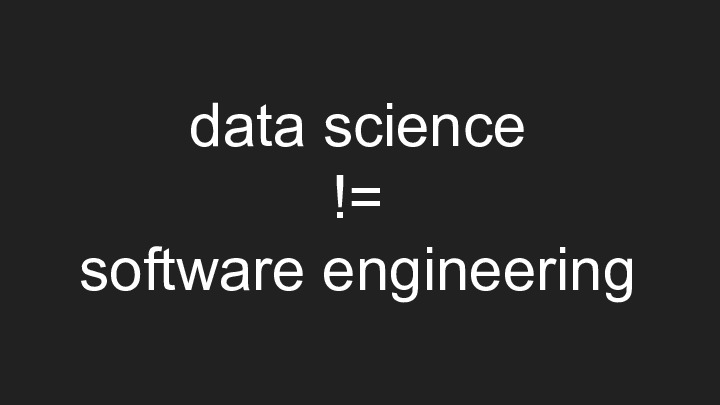

These slides were originally presented to an audience of R users by [Mark Sellors](https://sellorm.com) at [RStudio::conf](https://rstudio.com/conference) 2019 in Austin, Texas.

A video of the talk is available on the [RStudio website](https://resources.rstudio.com/rstudio-conf-2019/r-in-production).

## Slide 1

In this talk we'll look at some techniques for getting R running in production in your company.

Many R users find it difficult to get R outside of the data science bubble and into wider use within the business. Often, this is attributed to unhelpful IT departments, unwilling to adopt new approaches or methods. Whilst this perception is common, the reality is often that IT departments are not familiar with R and rarely have the bandwidth (or budget) to learn more about it.

In the slides that follow, we'll take a look at the two main approaches that people use to successfully get R in production and begin deliver the benefits of R to the wider business.

## Slide 2 & 3

There's no magic formula to running any language in production and R is no different. You won't find any weird tricks or any magic functions in this talk.

## Slide 4

Our starting position is that all of the technical barriers to running R in production are (comparatively) easy to overcome, but that it's the cultural issues that slow us down. It's these cultural barriers we're going to focus on here.

## Slide 6

What is production anyway?

## Slide 7

This is the sort of image that people will often think of when the word "production" is used. Large scale data centres running huge systems, but is that "scale" more than it is "production"?

## Slide 8 & 9

Production is anything that is run **repeatedly (or continuously)** and is **relied upon**. Acknowledging this is the key to running any language in production. For those of us working on data products "relied upon" generally means that the outputs are used in a decision making process somewhere. Production systems can be relied upon by thousands of people, or a single person the scale is not important.

## Slide 10

R is a great language to run in production. It's mature, stable, has many existing production users, an extensive package ecosystem and it's essentially become the lingua franca of data.

## Slide 11 & 12

So, how do we get there? There are two main techniques that I've seen people use and I refer to these as the left-hand and right-hand paths.

## Slide 13 & 14

The left hand path is the path of magic.

This simple technique works well, but can backfire. The basic goal is to impress a decision maker higher up in the organisation who can exert downward pressure on the business in general and the IT team in particular. If you can impress this person enough they'll push through your project to allow you to run R in production.

The main issue with this approach is that it's quite confrontational and is unlikely to make you any friends. That said, there are many examples of it working well and enabling the business to take this important step.

## Slide 15 & 16

The other option is the right hand path.

This approach directly addresses the elephant in the room, getting R past your IT team and into
production.

The first thing we need to do here is clear up this IT-team-as-the-enemy trope. In the vast majority of
large organisations the IT team exists purely to enact the technical will of the business and the way it
works is an expression of that will. In general IT teams are intentionally slow to change and risk-averse.
As the gatekeepers of an organisation's infrastructure the IT team -- or ops, or devops or whatever they're
called in your business -- have the ultimate responsibility for the security of the business's information.
As a consequence they have a natural tendency towards conservatism when it comes to the infrastructure that
they're responsible for.

This responsibility often puts them at odds with the goals of a data scientist, which is generally to
access and leverage data. Given these conflicting priorities it is unsurprising that there is sometimes
friction between these groups.

## Slide 17

Data science and software engineering aren't the same thing, though there is significant overlap.

In well run data science teams I don't usually expect to see much more than code reviews and methodological reviews - we must be sure the code does what we think it does and that the statistical methodologies used are appropriate for the task at hand.

Enterprise scale software engineering teams however, generally have many more hoops to jump through in their work and it is often siloed into very narrow bands to facilitate hand-offs between each activity. For example, a developer may be able to run automated and unit tests themselves but their code will often go to a specific test team for further testing, such as User Acceptance Testing or UAT, before passing on to the next stage in the release process. This release process tends towards the lengthy and extremely rigourous. In some organisations the length of time it will take to release even a simple application to their production environment is so long that even the thought of bringing in anything new can be extremely problematic.

## Slide 18

These are just a few of the things you might need to get your head around when working to get R into a production setting.

To be clear, I'm not suggesting that all data scientists need to learn this stuff. For many there will be no need and for many others no interest - and that's absolutely fine - what we're talking about here is building a deeper understand of a different area of the business that you might have to work with. In some organisations this role can be taken on by specialist "R Admins" who understand the work of the IT team **and** the data science team and can act as a facilitator between the two.

## Slide 19

Unless you work in a very small company, you'll likely have to build bridges with other teams in order to land your work with R in production. Get to know these people and what drives them. There's often more common ground than you might think. At the end of the day getting R into production is about ensuring **confidence** in your work and building bridges with other teams within the organisation.

## Slide 20

Use this checklist as the basis for your own on what needs to be considered to get your work into production.

One of my favourites from this list is "Support": Who will provide support to your application once it goes live? Do you want to receive support calls at 3am if something breaks or does someone else need to be trained up for that role?

## Slide 21 & 22

If you can negotiate all of that and help the business to gain the confidence in your work that it needs you'll make it to production - congratulations!

And if you do make it to production please share your experiences - production stories will help us all to raise our game and demonstrate the validity and utility of running R in production.

## Slide 23

* [Field Guide to the R Ecosystem](https://fg2re.sellorm.com): a guide for those new to the R ecosystem and targeted specifically at Ops teams and managers
* [Shiny in production](https://kellobri.github.io/shiny-prod-book/) (Kelly O'Briant and Sean Lopp): a supplement to the 'Shiny in Production' 2 day workshop delivered at RStudio::conf 2019
* [Companies using R](https://github.com/ThinkR-open/companies-using-r) (Colin Fay/ThinkR): a great resource to see what others are already doing with R from ThinkR
