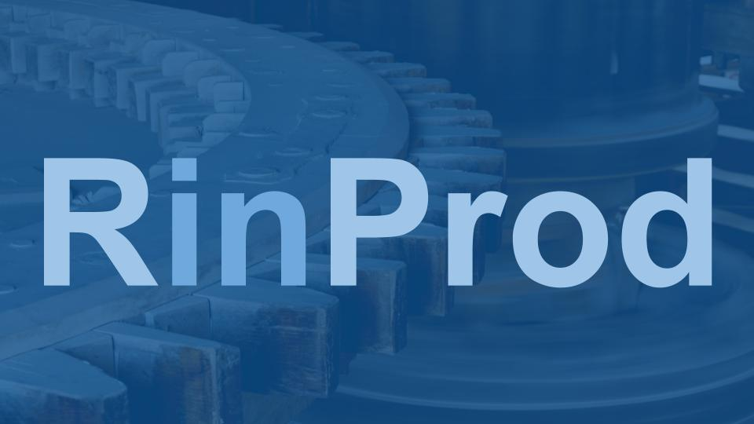

#  {.unnumbered}

{width="100%"}

RinProd.com is not your standard R website or blog. This website isn't really even aimed at R users (there are lots of better sites for that audience) but rather the IT and Ops professionals tasked with building and maintaining R based infrastructure.

The goal of the project is to provide that audience with the information they need to expand the analytics capability that they're able to offer for their businesses.

If you find a problem with this site, or think that something is missing, let us know on the [GitHub issue tracker](https://github.com/rinprod/rinprod.com/issues) for the project.

## License

This work is licensed under a [Creative Commons Attribution 4.0 International License](https://creativecommons.org/licenses/by/4.0/).

------------------------------------------------------------------------

# About

more and more people and businesses around the world are turning to R as their language of choice for data science and other data related programming tasks.

R's maturity, flexibility and rich syntax is drawing more users every day.

most of those users have little to no experience of running r in production settings however. and when businesses turn to their it teams for support, they're often left scratching their heads at the idea of supporting a new language that they've probably never encountered before.

where to even begin?

fortunately, this book is here to help.

## Who's this book for?

this book is for anyone looking to understand what it means to run R in production. whether you're an it pro who's never heard of R or a seasoned R user looking to branch out into more of operational role, this book can help.

### The IT Pro:

Maybe you're an experienced IT professional on the verge of supporting data science with R users in your organisation. You've maybe only heard of R for the first time last week and feel ill-at-ease with the idea of supporting your business's users.

### The Technical Data Scientist

Perhaps you're a data scientist with a passion for the technical and want to better help yourself and your business move R into a more central role in your organisation. You're not so familiar with computing infrastructure, but you have an obvious thirst for knowledge.

### The Business Leader

Or maybe you're actually leading the business and want to make sure you've considered all the angles and that you're doing things the right way.

### Whoever you are...

Whatever your motivation (and a great many of the lessons here are transferable directly across other languages too!) this book will provide you with a fantastic foundation for running R in production settings. No matter the size of your organisation this book will provide you with know-how and learning direct from those who've "been there, and done that"

## About the author

Mark has been running R in production settings since 2013. firstly as a consultant with a global roster of clients, before joining RStudio.

Mark has many years experience of running enterprise systems.

------------------------------------------------------------------------

# What this book is not

If you're an **R user** looking for more information on *writing* R for production use cases, this book isn't really about that, so check the [resources for writing production R](/writing-production-r/) page instead.

## Understanding R and it's ecosystem

The best place to start your journey towards understanding the world of R is the [Field Guide to the R Ecosystem](https://fg2re.sellorm.com). It's a concise, non-technical introduction to the language and supporting software. The guide presumes no previous knowledge of R or any other programming language and is aimed primarily at managers and IT professionals approaching the language for the first time.

------------------------------------------------------------------------

# Getting started

## What is R?

R is a programming language specifically created for statistical computing. This is in contrast to most programming languages that are designed for general purpose computing.

## What is "production"?

Some people will try to tell you that a production system must be comprised of hundreds of components and serving the needs of thousands of users or more.

of course this is gate-keeping nonsense. a production system is simply a system that is relied upon.

if your company relies on a system running under you colleague Silvie's desk, then that system is a production system. whether its managed like a production system is an entirely different question.

to manage a system as though its a productions system means to treat its role seriously. this mainly means planning for contingencies; what happens when the server its on breaks? what happens if the disk fails and you lose your code? who should receive the support call in the middle of the night if its not working? is the system under Sylvie's desk powerful enough to meet the needs of the application in the short to medium term. and so on.

## Can you use R in production

Cover the familiar complaints - scalability etc

of course! there will always be people who tell you that its not suitable for some reason, but that usually just means that they themselves don't know how to do it.

every programming language has its adherents and its detractors and R is no different. since r is primarily used in data science and related fields, it is not widely understood outside of those circles.

------------------------------------------------------------------------

# How R users work/How data scientists work

The different types of analytics: descriptive, diagnostic, predictive and prescriptive.

-   Descriptive - What has happened?
-   Diagnostic - Why did it happen?
-   Predictive - What will (might?) happen?
-   Prescriptive - What should we do?

EXPAND ON THESE AND PROVIDE EXAMPLES!!

When people outside of the data science world look at the work of a data scientist, it's easy to mistake it for software development and indeed there are many similarities. however, the main output of software development is software, whereas for data science, the main output is insight and knowledge.

programming is simply a means to an end as the computer can provide, in the right hands, a powerful tool to help understand the world around us.

performance vs methodological rigour etc.

Reproducible research

## Exploratory Data Analysis (EDA)

## Software Development Life Cycle (SDLC) and R

that traditional software development life-cycle is some version of this;

develop -\> test -\> production

The testing stage in particular can comprise many sub-stages, eg user acceptance testing, unit testing, integration testing etc.

it can be tempting to look at the work of a data scientist and assume that they are sloppy and poorly disciplined, since there is rarely a formal testing phase conducted by a party apart from the developer.

remember though that data science is not strictly software development and a data scientist will test a hypothesis as much as their software.

in many cases rigourosly testing the software part of a data science project or building out complex test tooling and infrastructure is actually a waste of resources.

## Hadley's data science life-cycle

mixing and matching

the type of work varies from project for project

sometimes the SDLC is a good fit and sometimes Hadley's thing is a good fit. sometimes its a hybrid approach

------------------------------------------------------------------------

# R infra requirements

## Packages

## Code Development

## Shiny apps

## Other content types eg Rmd and scripts

------------------------------------------------------------------------

# Tooling

## Open source

## Commercial

## Desktop vs Server

# R infrastructure patterns

Desktop is the first and most obvious.

## Moving beyond the desktop

### basics

### advanced

### Enterprise

Most complex setups, but also what are the patterns?

Single system for the entire business? Or federated systems throughout the business ie, one system per team

Single server Clusters HPC Spark?

------------------------------------------------------------------------

# Automation

## Testing

## CI/CD with R

------------------------------------------------------------------------

# Linux and R

# Infrastructure revisited

## Server

Cloud/on-prem

## docker

# Ongoing maintenance and support

## Who supports this stuff?

-   handover?
-   Self support

------------------------------------------------------------------------

# Best practices for R developers

Not code stuff, but more about the management of the overall environment.

eg "how do we handle secrets?"

-   Don't hard code them in your scripts
-   Use an alternate strategy, eg config, env vars etc.

## Secrets

## Database connections

------------------------------------------------------------------------

# Running R in production

What does running R assets in production look like?

There are four main asset classes that you can create with R and they fall into 2 runtime categories.

The four asset classes are:

-   Scripts

-   Rmarkdown documents

-   Shiny apps

-   Plumber apps

And the runtime categories are:

-   one-off - scripts and Rmds

-   persistent - shiny and plumber

The one-off runtime options are run once in that they're started, they execute whatever they've been programmed to, then the finish. They can be literally run once, run on an ad-hoc basis (eg. in the case of a a command line tool that is run when required by a user) or on a schedule, eg a cron job.

## Scripts

## Rmds

## Shiny

## APIs

------------------------------------------------------------------------

# Installing R and associated tools

## Python too?

## standard installs

Side-by--side versions

System dependencies

## Additional tools

RStudio Server/Pro

Shiny Server

RStudio Connect

RSPM vs PPM etc.

# Version control

Use it!

We talk about git because it's essentially a de-facto standard at this point.

A git repo should be a discrete project. The smaller the scope of the repo the better.

# Environments

We should probably say something about environments.

renv, CRAN repo usage management, CRAN repo management etc.

# The business of production

Processes for production flows.

Pay careful consideration to customers with heavily regulated workflows.

five P's - Process, procedure, policing etc.

## A lab environment

essential for experimentation and for data scientists to be able to define the parameters of their own work.

You wouldn't stock a chemistry lab with ancient kit, why do the same to your data scientists? Of course this should be separate to your production environment (if you're in a high-stakes/high-risk business). In this case you can provide a more locked-down or controlled enviironment for production that can be fed and adapted through work done in the lab.

Our German colleagues often refer to this a Speilzeit or "play-time" in English. Playing around with software like this can be a great way to learn features and get to grips with new methods.

# Frameworks

Are there any specific frameworks we can share?

# Checklists

Checklists can help us get where we're going faster by providing a simple way to see what's needs to be done, what's been done and what's left to do.

Adapt these to your own organisation.

------------------------------------------------------------------------

# Linux basics

Do we need **Networking basics** first?

Some or all of the following...

Linux system administration for data science?

What makes this for "data science"?

Who is this book for?

Why Linux?

-   What's wrong with Windows?

Which Linux? How to choose.:

-   Compare and contrast

-   Best Linux for data science

Accessing Linux:

-   client side set up

-   ssh

Standing up a server:

-   local/cloud

-   real/virtual

-   docker

Logging in and looking around:

-   Running commands

-   Basic commands

-   Files

-   directories

-   users/groups

-   ownership

-   editing (crash course in vim?)

-   permissions

-   shell scripts

-   curl

Users:

-   who am I

-   root

-   sudo

Installing packages:

-   repositories

-   differences between linuxes

-   updating packages

Installing software:

-   Install R and Python

-   when to use OS supplied software and when not to.

Processes and process management

-   What are they

-   systemd

-   systemctl basics

Advanced user topics:

-   Env vars

-   paths

-   ssh keys

Authentication:

-   local

-   ad joined

-   Multi-user management

Disk space:

-   du

-   df

Remote file systems:

-   NFS

-   CIFS

Networking

-   IP addresses

-   DNS

-   ports

-   proxies.

Security:

-   firewalls etc.

-   certificates

Advance architectures

-   HA and load balancing

-   proxies (forward and reverse),

-   Kubernetes

-   docker

-   slurm (and HPC generally)

**Watch out for the "Data Science at the Command Line" book by Jerome Jannsens**

------------------------------------------------------------------------

# Enterprise Stuff

## Validation

Ask yourself what this means.

R has some validation documentation available for the core language.

Your business must decide what it means to "validate".

eg. Are "validated" packages sufficient. Then you must consider how to deliver those packages to your end users.

## Release Management

ad-hoc and data science output will not need to be released, since they're the "insight" output we discussed in the first chapter.

Additional considerations should definitely be made for long running data sience projects though. However, remember the SDLC discussion and that data science generally needs to be about speed of delivery. Which is not to say that we should value that over all else, just that a 100% accurate prediction delivered 10 seconds after it can be used has as much value to the business as a coin flip.

## Governance

How should you manage all this stuff?

Can seem daunting, but you can approach it in stages.

The stages can be either increasing levels of adoption in the business. eg EDA first, then a shiny app etc.

Or you can adopt the tools in stages.

Or you can increase your reliance on the work you're producing in stages. eg. diagnostic first, then descriptive, then predictive, then prescriptive.

Start where the stakes are low.

## Relying on open-source

Should you rely on open source packages? Can you rely on them?

Yes, but you should exercise the appropriate amount of caution for the task at hand. If for instance you're making decisions about people's lives based on an open source package, it's important that you have a view on the methodological fitness for purpose of that package.

-   Is the author of the package well known/trusted?

-   Is the package well used? (Speaks to trustworthiness in the community)

## Build vs Buy

Much of the infrastructure you might need to run R in production environments already exists in the open-source world.

The commercial sector however does provide a number of important benefits. The products themselves often have additional features. They're supported by professional support teams with SLA's and access to the developers

## Managing R in production

Do we need to have something about how we might manage systems, people and code for production use cases?
